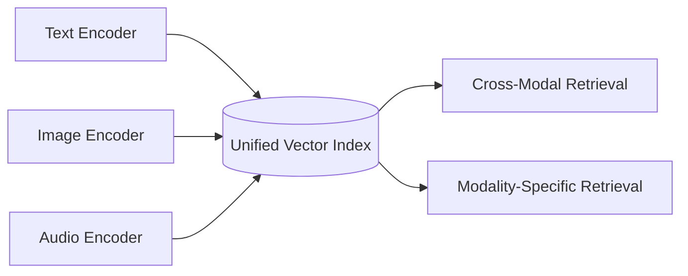

# Multimodal Memory

Trinity supports storing and retrieving memories across multiple modalities — text, images, and audio — in a unified vector index. This enables cross-modal retrieval, where a text query can find relevant images, or an image query can retrieve associated text memories.

---

## Overview

The multimodal system is built on three pillars:



1. **Unified Embedding Space** — All modalities are encoded into vectors of the same dimensionality.
2. **Modality Metadata** — Each memory is tagged with its source modality for filtering.
3. **Cross-Modal Alignment** — Encoders are trained or configured to map similar concepts close together in vector space.

---

## Supported Modalities

### Text

Text is the default modality and requires no additional configuration.

```python
memory.store(
    user_id="alice",
    content="The Eiffel Tower is in Paris, France.",
    memory_type="fact"
)
```

### Images

Store images from local paths, URLs, or bytes. Images are automatically encoded and indexed.

```python
# Store an image from a URL
memory.store_image(
    user_id="alice",
    image_url="https://example.com/photo.jpg",
    caption="Alice at the Eiffel Tower",
    metadata={"location": "Paris", "date": "2026-07-14"}
)

# Store an image from a local file
memory.store_image(
    user_id="alice",
    image_path="/home/alice/photos/vacation.jpg",
    caption="Sunset over the mountains"
)

# Store an image from raw bytes
with open("photo.png", "rb") as f:
    memory.store_image(
        user_id="alice",
        image_bytes=f.read(),
        caption="Screenshot of dashboard",
        metadata={"app": "analytics"}
    )
```

**Image Memory Parameters:**

| Parameter | Type | Description |
|---|---|---|
| `user_id` | `str` | User identifier |
| `image_url` | `str` | HTTP/HTTPS URL to the image |
| `image_path` | `str` | Local file path |
| `image_bytes` | `bytes` | Raw image bytes |
| `caption` | `str` | Optional text caption (also indexed) |
| `metadata` | `dict` | Additional metadata |
| `tenant_id` | `str` | Tenant for isolation |

!!! note
    You must provide exactly one of `image_url`, `image_path`, or `image_bytes`.

### Audio

Store audio recordings or files. Audio is transcribed and encoded.

```python
# Store audio from a file
memory.store_audio(
    user_id="alice",
    audio_path="/home/alice/recordings/meeting-notes.wav",
    transcript="Meeting notes: discussed Q3 roadmap...",
    metadata={"duration_seconds": 120, "speaker": "Alice"}
)

# Store audio with auto-transcription
memory.store_audio(
    user_id="alice",
    audio_path="lecture.mp3",
    language="en",
    metadata={"source": "lecture", "topic": "machine learning"}
)
```

**Audio Memory Parameters:**

| Parameter | Type | Description |
|---|---|---|
| `user_id` | `str` | User identifier |
| `audio_url` | `str` | HTTP/HTTPS URL to the audio file |
| `audio_path` | `str` | Local file path |
| `audio_bytes` | `bytes` | Raw audio bytes |
| `transcript` | `str` | Optional pre-existing transcript |
| `language` | `str` | Language code for auto-transcription (e.g., `en`, `zh`) |
| `metadata` | `dict` | Additional metadata |

---

## Cross-Modal Search

The most powerful feature of multimodal memory is the ability to search across modalities.

### Text Query → All Modalities

```python
# A text query can find images and audio, not just text
results = memory.retrieve(
    user_id="alice",
    query="photos of landmarks in Paris",
    top_k=10
)

for r in results:
    print(f"[{r.modality}] {r.content}")
    # Output might include:
    # [image] Alice at the Eiffel Tower (score: 0.91)
    # [text] The Eiffel Tower is in Paris, France. (score: 0.87)
    # [audio] Audio recording about Paris trip (score: 0.72)
```

### Image Query → Related Memories

```python
# Use an image as the query
results = memory.search_by_image(
    user_id="alice",
    query_image_path="query_photo.jpg",
    top_k=5
)

for r in results:
    print(f"Relevant: {r.content} (modality: {r.modality}, score: {r.score:.2f})")
```

### Filter by Modality

```python
# Retrieve only image memories
images = memory.retrieve(
    user_id="alice",
    query="vacation memories",
    memory_types=["image"],  # Filter to images only
    top_k=20
)

# Retrieve only audio memories
audio_notes = memory.retrieve(
    user_id="alice",
    query="meeting notes",
    memory_types=["audio"],
    top_k=10
)
```

---

## Encoders

Trinity supports pluggable encoder backends for each modality.

### Text Encoders

| Model | Dimensions | Description |
|---|---|---|
| `text-embedding-ada-002` | 1536 | OpenAI's text embedding model |
| `text-embedding-3-small` | 1536 | OpenAI's latest small embedding |
| `text-embedding-3-large` | 3072 | OpenAI's latest large embedding |
| `all-MiniLM-L6-v2` | 384 | Lightweight local model (sentence-transformers) |
| `all-mpnet-base-v2` | 768 | High-quality local model (sentence-transformers) |

### Image Encoders

| Model | Dimensions | Description |
|---|---|---|
| `clip-ViT-B-32` | 512 | OpenAI CLIP ViT-B/32 |
| `clip-ViT-L-14` | 768 | OpenAI CLIP ViT-L/14 |
| `siglip-so400m` | 1152 | Google SigLIP large model |

### Audio Encoders

| Model | Description |
|---|---|
| `whisper-tiny` | Lightweight transcription (English) |
| `whisper-base` | Base transcription model |
| `whisper-large-v3` | High-accuracy transcription |
| `clap-audio` | CLAP audio-text embedding |

### Configuration

```python
from trinity import Trinity

memory = Trinity(
    backend="postgresql",
    embedding_model="text-embedding-3-small",
    image_encoder="clip-ViT-L-14",      # Image encoder
    audio_encoder="whisper-base",        # Audio transcription
    multimodal_dim=768,                  # Unified embedding dimension
)
```

---

## Storage Considerations

### Embedding Storage

Multimodal vectors require more storage. Estimate your storage needs:

```python
# Each embedding is a vector of floats
vector_bytes = dimensions * 4  # float32 = 4 bytes

# With 768 dimensions: ~3 KB per embedding + overhead
# 1 million multimodal memories ≈ 4-6 GB
```

### PostgreSQL with pgvector

For multimodal workloads, ensure your pgvector configuration is optimized:

```sql
-- Use IVFFlat with appropriate number of lists
CREATE INDEX idx_embeddings ON memories
    USING ivfflat (embedding vector_cosine_ops)
    WITH (lists = 100);

-- For larger datasets (>1M), use HNSW for better recall
CREATE INDEX idx_embeddings_hnsw ON memories
    USING hnsw (embedding vector_cosine_ops)
    WITH (m = 16, ef_construction = 200);
```

---

## Best Practices

### 1. Always Add Captions

Text captions improve cross-modal retrieval significantly:

```python
# Good — descriptive caption
memory.store_image(
    user_id="alice",
    image_path="img001.jpg",
    caption="Alice's team celebrating the Q2 launch at the office rooftop"
)

# Less effective — generic caption
memory.store_image(
    user_id="alice",
    image_path="img001.jpg",
    caption="Photo"
)
```

### 2. Preprocess Images

Resize images to standard dimensions before storage to improve performance:

```python
from trinity.utils import preprocess_image

processed = preprocess_image(
    image_path="large_photo.jpg",
    max_size=1024,        # Max dimension in pixels
    quality=85             # JPEG quality (1-100)
)
memory.store_image(user_id="alice", image_bytes=processed, caption="...")
```

### 3. Batch Operations

For bulk imports, use batch operations:

```python
# Batch store images
memory.store_images_batch(
    user_id="alice",
    images=[
        {"path": "photo1.jpg", "caption": "Beach sunset"},
        {"path": "photo2.jpg", "caption": "Mountain hike"},
        {"path": "photo3.jpg", "caption": "City skyline"},
    ],
    batch_size=10
)
```

### 4. Set Appropriate Dimensions

Choose embedding dimensions based on your accuracy and performance requirements:

| Dimensions | Use Case | Recall | Speed |
|---|---|---|---|
| 384 | Lightweight, mobile | Good | Fastest |
| 768 | General purpose | Better | Fast |
| 1536 | High accuracy | Best | Moderate |
| 3072 | Maximum accuracy | Highest | Slower |

---

## Next Steps

- **[Deployment Guide](deployment.md)** — Deploy Trinity with multimodal support in production.
- **[Benchmarks](benchmarks.md)** — Performance comparison across modalities.
- **[API Reference](api-reference.md)** — Complete multimodal API documentation.
